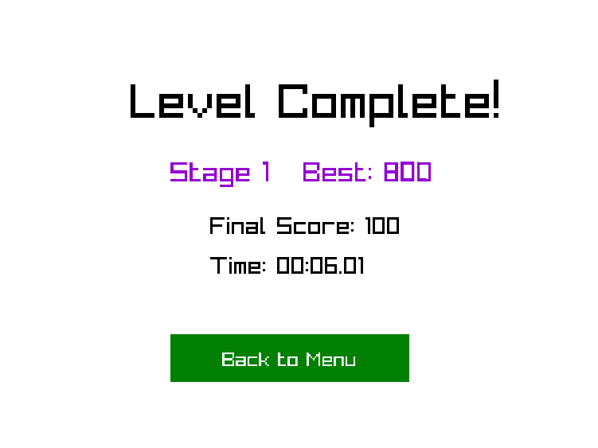
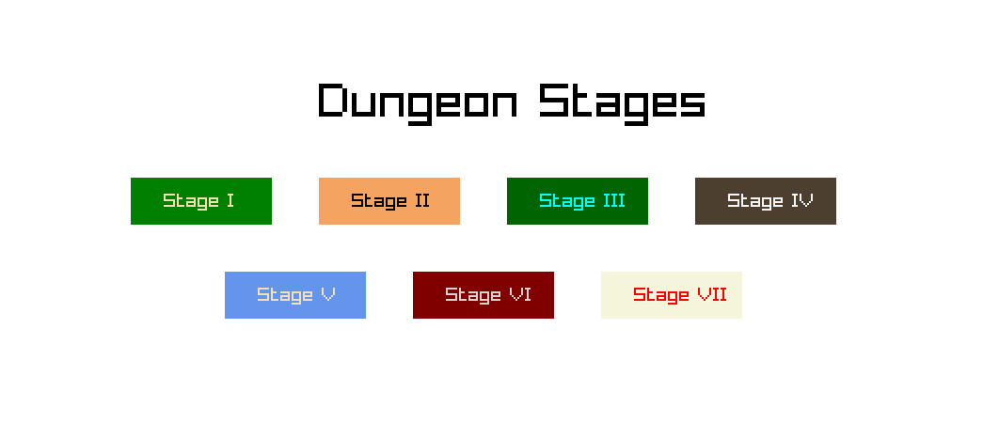
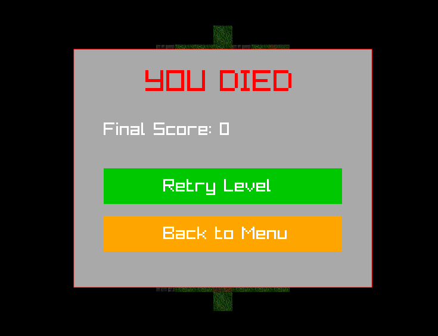
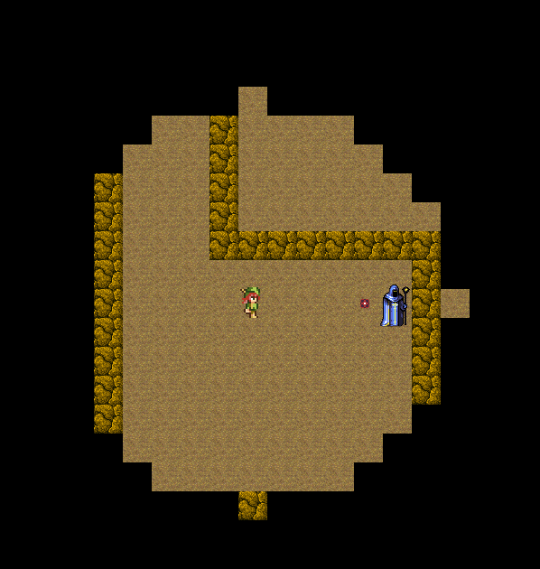
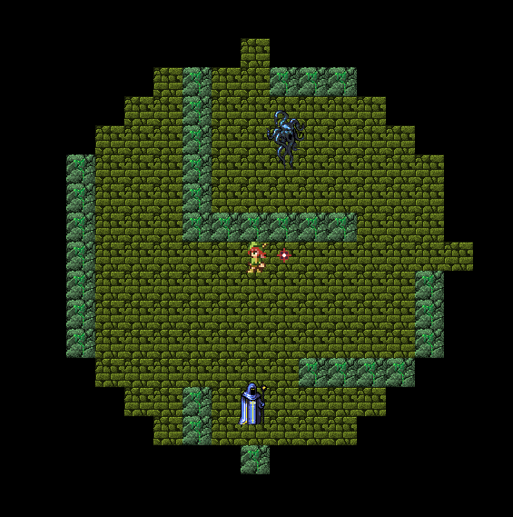
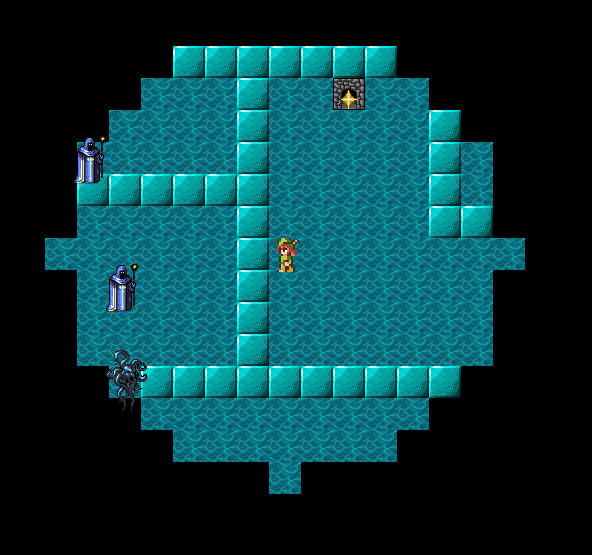
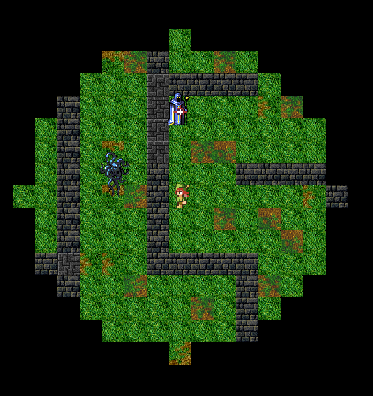
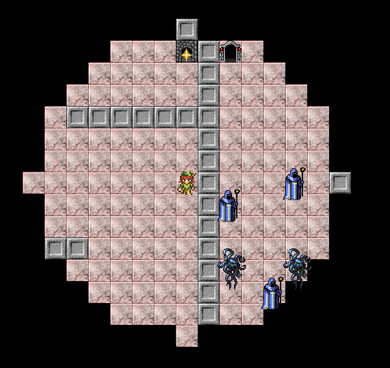
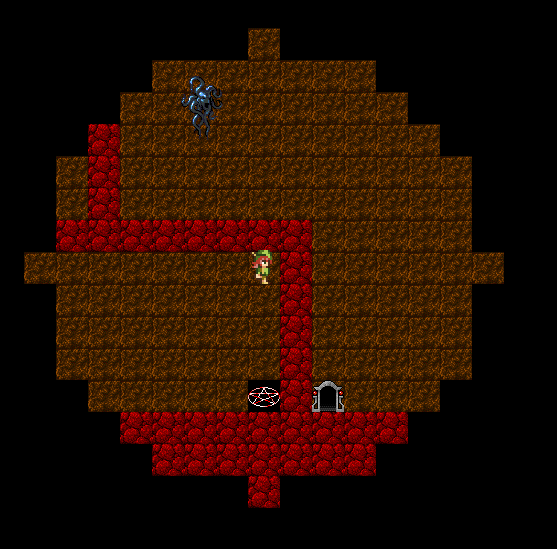

# Rust Raylib Dungeon Diver
This is a simple game framework for Raylib using Rust. The design and logics was developed by Bao Le. Maps are made by Khangai Enkhbat, with the tool map created by ChatGPT.

## Story
- This is a world where labyrinth rises on their own, controlled by an unknown creature and resides by monsters.
- No one know where the labyrinth master are or when did they start to appear. Before anyone know, it has already been there.
- A labyrinth consist of different dungeon floor, each with its own unique conditions.
- This current labyrinth only has a *Groper* and *Soul Mage* resides on different dungeon levels. Rumor says that labyrinth could evolve on its own and new monster would be born.
- There is a job called hunter. Hunter comes to the dungeon, kill and take the monster corpses in exchange for point - currency of this world.
- You are a female ranger. You come to these dungeons seeking for wealth like anyone esle.
- However, would you come out alive to earn those points are not guarantee...

## Features
- A maze + labyrinth diver game.
- featuring 2 types of monster (Tank type - *Groper* and Shooter - *Soul Mage*).
- Win the game by finding your way out of the maze while killing as much entities as possible for bigger points.

## Previews
Screenshot from the game

